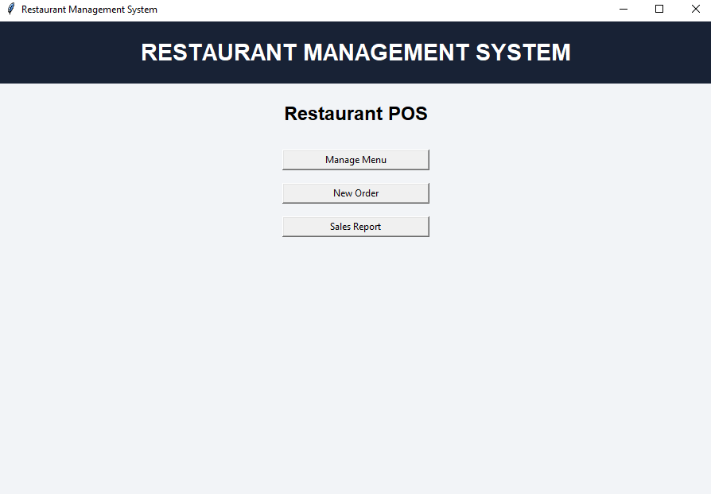
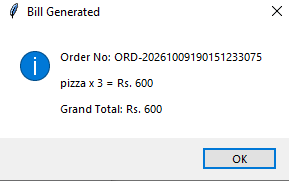

# Restaurant Management System

A Restaurant Management System built using Python, Tkinter, and MySQL.

## Features

* Manage restaurant menu items
* Create customer orders and calculate bills
* View sales reports
* Desktop graphical user interface

## Technologies Used

* Python
* Tkinter
* MySQL

## Project Objective

The objective of this project is to simplify restaurant operations by managing menu items, billing, and sales records through a desktop application.

## Author

Priyansh

## Note

This project was developed for learning and educational purposes.

## Screenshots

### Home Screen



### Manage Menu


### New Order and Billing


### Sales Report


## Installation and Setup

### Requirements

* Python 3
* MySQL Server
* Required Python packages used by the project

### Setup Instructions

1. Clone or download this repository.
2. Create a MySQL database named `project`.
3. Create the required tables: `hotel` and `report`.
4. Copy `db_config.example.py` and rename the copy to `db_config.py`.
5. Open `db_config.py` and enter your own MySQL username, password, host, and database name.
6. Install the Python packages required by the project.
7. pip install -r requirements.txt
8. Run `restaurant_gui_public.py` using Python.

### Security Note

Do not upload `db_config.py` or any file containing real database credentials to a public repository.

### Project Features

* Restaurant menu management
* New order and billing
* Sales report
* MySQL database integration
* Tkinter graphical user interface


### Database Setup

Run the following SQL commands in MySQL to create the database and required tables:

```sql
CREATE DATABASE IF NOT EXISTS project;
USE project;

CREATE TABLE hotel (
    ino INT NOT NULL PRIMARY KEY,
    iname VARCHAR(25) DEFAULT NULL,
    iprice INT DEFAULT NULL
);

CREATE TABLE report (
    order_no VARCHAR(25) DEFAULT NULL,
    tot_amount INT DEFAULT NULL
);
```

### Billing


